# Design Document: Infraestrutura rAthena Server

## Overview

Este documento descreve a arquitetura técnica e o design da infraestrutura de produção para um servidor privado de Ragnarok Online baseado no emulador rAthena. A solução é inteiramente containerizada via Docker Compose, rodando em Ubuntu 24.04 LTS, com monitoramento Zabbix + Grafana, backup automatizado, CI/CD via GitHub Actions, painel web FluxCP e proteção contra DDoS.

### Decisões Arquiteturais Chave

| Decisão | Escolha | Justificativa |
|---------|---------|---------------|
| Orquestração | Docker Compose | Simplicidade para single-host, declarativo, sem overhead de Kubernetes |
| Imagem base build | `debian:bookworm-slim` | Compatibilidade com libs do rAthena, pacotes atualizados |
| Imagem base runtime | `debian:bookworm-slim` | Mínima, ~80MB, mantém compatibilidade ABI |
| Banco de dados | MariaDB 11.4 LTS | Versão LTS com suporte estendido, compatível com rAthena |
| Monitoramento | Zabbix 7.0 LTS + Grafana 11 | Enterprise-grade, templates prontos, alertas nativos |
| Web Panel | FluxCP (PHP 8.2 + Apache) | Painel oficial da comunidade rAthena |
| CI/CD | GitHub Actions | Integração nativa com GHCR, sem custo para repositórios públicos |
| Backup | Container dedicado com cron | Isolamento de responsabilidade, fácil agendamento |

### Pesquisa e Referências

- rAthena utiliza `./configure && make` para compilação, com dependências: gcc, g++, make, git, libmariadb-dev, zlib1g-dev, libpcre3-dev ([rAthena Wiki](https://github.com/rathena/rathena/wiki/Installation)). O suporte a MariaDB é auto-detectado via pkg-config quando `libmariadb-dev` está presente — não é necessária flag explícita como `--enable-manager=yes`
- Dependências de runtime reduzidas: libmariadb3, zlib1g, libpcre3
- Zabbix Docker oficial suporta deploy com MySQL/MariaDB backend ([Zabbix Blog](https://blog.zabbix.com/deploying-zabbix-components-with-docker-and-docker-compose/30025/))
- FluxCP é PHP puro, compatível com PHP 8.x, requer extensões: mysql, gd, mbstring ([FluxCP GitHub](https://github.com/rathena/FluxCP))
- Docker best practices 2026: multi-stage builds, non-root users, pinned versions, health checks

## Architecture

### Diagrama de Alto Nível

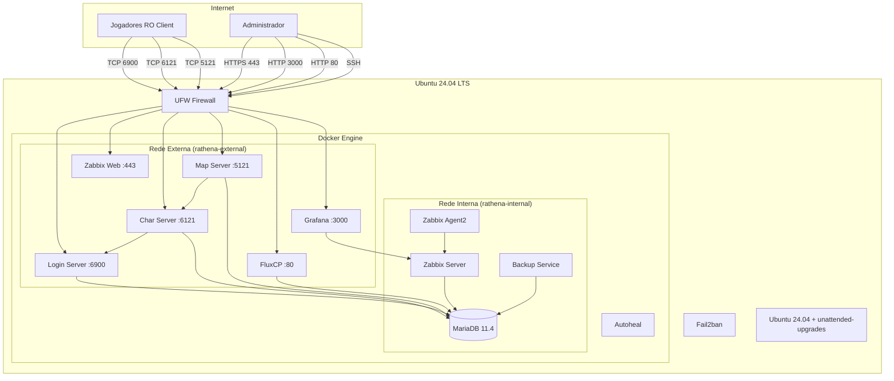

### Diagrama de Redes Docker

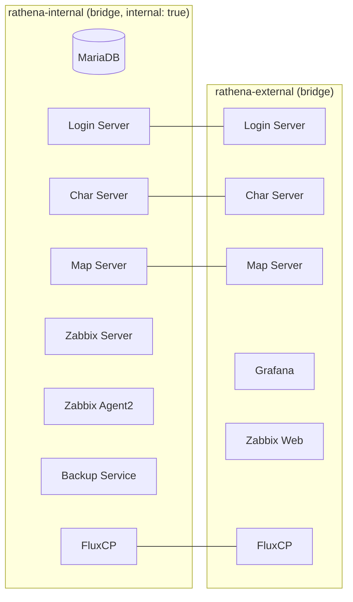

**Nota:** Os serviços rAthena, FluxCP e Zabbix Web participam de ambas as redes. MariaDB, Zabbix Server, Zabbix Agent e Backup Service ficam isolados na rede interna.

### Cadeia de Dependências (Startup Order)

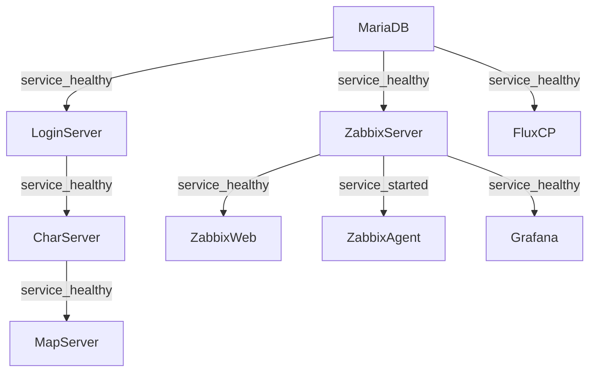

## Components and Interfaces

**Nota:** Os limites de recursos são configurados via `deploy.resources.limits` no Docker Compose v2+:
```yaml
deploy:
  resources:
    limits:
      cpus: '0.5'
      memory: 512M
    reservations:
      cpus: '0.25'
      memory: 256M
```

### 1. Login Server

| Aspecto | Detalhe |
|---------|---------|
| Imagem | `rathena-login:${COMMIT_SHA}` (multi-stage build) |
| Porta exposta | 6900 (TCP) |
| Redes | rathena-internal, rathena-external |
| Volumes | `./conf/templates:/rathena/conf/templates:ro`, `/opt/rathena/logs/login:/rathena/log` |
| Healthcheck | `nc -z localhost 6900` |
| Dependências | MariaDB (healthy) |
| Recursos | CPU: 0.5, Memória: 512MB |

**Interface:** Aceita conexões do cliente RO (autenticação de conta), comunica-se com MariaDB para validar credenciais, aceita registros do Char Server via Inter_Server_Password.

### 2. Char Server

| Aspecto | Detalhe |
|---------|---------|
| Imagem | `rathena-char:${COMMIT_SHA}` (multi-stage build) |
| Porta exposta | 6121 (TCP) |
| Redes | rathena-internal, rathena-external |
| Volumes | `./conf/templates:/rathena/conf/templates:ro`, `/opt/rathena/logs/char:/rathena/log` |
| Healthcheck | `nc -z localhost 6121` |
| Dependências | Login Server (healthy) |
| Recursos | CPU: 0.5, Memória: 512MB |

**Interface:** Gerencia personagens, guilds e storage. Autentica-se no Login Server via Inter_Server_Password. Aceita registros do Map Server.

### 3. Map Server

| Aspecto | Detalhe |
|---------|---------|
| Imagem | `rathena-map:${COMMIT_SHA}` (multi-stage build) |
| Porta exposta | 5121 (TCP) |
| Redes | rathena-internal, rathena-external |
| Volumes | `./conf/templates:/rathena/conf/templates:ro`, `./npc/custom:/rathena/npc/custom:ro`, `/opt/rathena/logs/map:/rathena/log` |
| Healthcheck | `nc -z localhost 5121` |
| Dependências | Char Server (healthy) |
| Recursos | CPU: 2.0, Memória: 2048MB |

**Interface:** Processa toda a lógica de jogo (combate, NPCs, mapas). Maior consumo de recursos. Autentica-se no Char Server via Inter_Server_Password.

### 4. MariaDB

| Aspecto | Detalhe |
|---------|---------|
| Imagem | `mariadb:11.4` (pinada) |
| Porta exposta | Nenhuma (apenas rede interna) |
| Redes | rathena-internal |
| Volumes | `rathena-db-data:/var/lib/mysql`, `./sql:/docker-entrypoint-initdb.d:ro`, `./db/conf.d:/etc/mysql/conf.d:ro` |
| Healthcheck | `healthcheck.sh --connect --innodb_initialized` |
| Recursos | CPU: 1.0, Memória: 2048MB |

**Interface:** Armazena todos os dados persistentes do jogo. Aceita conexões apenas da rede interna. Expõe socket MySQL na porta 3306 intra-container.

### 5. Zabbix Server

| Aspecto | Detalhe |
|---------|---------|
| Imagem | `zabbix/zabbix-server-mysql:7.0-ubuntu-latest` (pinada) |
| Porta | 10051 (interna) |
| Redes | rathena-internal |
| Volumes | `zabbix-server-data:/var/lib/zabbix` |
| Healthcheck | `zabbix_server -R config_cache_reload` ou TCP 10051 |
| Dependências | MariaDB (healthy) |
| Recursos | CPU: 0.5, Memória: 1024MB |

### 6. Zabbix Web Frontend

| Aspecto | Detalhe |
|---------|---------|
| Imagem | `zabbix/zabbix-web-nginx-mysql:7.0-ubuntu-latest` (pinada) |
| Porta exposta | 443 (HTTPS) |
| Redes | rathena-internal, rathena-external |
| Dependências | Zabbix Server (healthy) |
| Recursos | CPU: 0.25, Memória: 512MB |

**Nota TLS:** A imagem oficial `zabbix-web-nginx-mysql` suporta HTTPS nativamente via variáveis de ambiente `ZBX_SERVER_HOST` e montagem de certificados em `/etc/ssl/nginx/`. Para produção, montar certificado TLS (Let's Encrypt ou self-signed) em volume:
```yaml
volumes:
  - ./certs/zabbix.crt:/etc/ssl/nginx/ssl.crt:ro
  - ./certs/zabbix.key:/etc/ssl/nginx/ssl.key:ro
environment:
  - ZBX_SERVER_HOST=zabbix-server
```
Alternativamente, usar proxy reverso (Nginx/Traefik) na frente do Zabbix Web para terminação TLS centralizada.

### 7. Zabbix Agent2

| Aspecto | Detalhe |
|---------|---------|
| Imagem | `zabbix/zabbix-agent2:7.0-ubuntu-latest` (pinada) |
| Redes | rathena-internal |
| Volumes | `/var/run/docker.sock:/var/run/docker.sock:ro` (para métricas de containers) |
| Dependências | Zabbix Server (started) |
| Recursos | CPU: 0.25, Memória: 256MB |

### 8. Grafana

| Aspecto | Detalhe |
|---------|---------|
| Imagem | `grafana/grafana-oss:11.6.0` (pinada, versão LTS) |
| Porta exposta | 3000 |
| Redes | rathena-internal, rathena-external |
| Volumes | `grafana-data:/var/lib/grafana`, `./monitoring/grafana/provisioning:/etc/grafana/provisioning:ro`, `./monitoring/grafana/dashboards:/var/lib/grafana/dashboards:ro` |
| Dependências | Zabbix Server (healthy) |
| Recursos | CPU: 0.5, Memória: 512MB |

### 9. Backup Service

| Aspecto | Detalhe |
|---------|---------|
| Imagem | `mariadb:11.4` (reutiliza imagem para ter mariadb-dump) |
| Redes | rathena-internal |
| Volumes | `rathena-backups:/backups`, `./conf:/rathena/conf:ro`, `./npc/custom:/rathena/npc/custom:ro`, `./scripts/backup:/scripts:ro` |
| Entrypoint | cron daemon com job às 04:00 UTC |
| Recursos | CPU: 0.25, Memória: 512MB |

### 10. FluxCP

| Aspecto | Detalhe |
|---------|---------|
| Imagem | `rathena-fluxcp:${COMMIT_SHA}` (build customizado PHP 8.2 + Apache) |
| Porta exposta | 80 (HTTP) |
| Redes | rathena-internal, rathena-external |
| Volumes | `fluxcp-data:/var/www/html/data` |
| Healthcheck | `curl -f http://localhost:80/ || exit 1` |
| Dependências | MariaDB (healthy) |
| Recursos | CPU: 0.25, Memória: 256MB |

### 11. Autoheal

| Aspecto | Detalhe |
|---------|---------|
| Imagem | `willfarrell/autoheal:1.2.0` (pinada) |
| Propósito | Monitora healthchecks Docker e reinicia containers unhealthy |
| Porta exposta | Nenhuma |
| Redes | Nenhuma (usa Docker socket) |
| Volumes | `/var/run/docker.sock:/var/run/docker.sock:ro` |
| Env | `AUTOHEAL_CONTAINER_LABEL=all` |
| Recursos | CPU: 0.1, Memória: 64MB |
| Restart | unless-stopped |

**Interface:** O Autoheal monitora o status de healthcheck de todos os containers. Quando um container é marcado como `unhealthy` (após 3 retries falharem), o Autoheal reinicia automaticamente o container. Isso resolve a limitação do Docker onde `restart: unless-stopped` só reinicia containers cujo processo saiu (exit), mas não containers marcados como unhealthy pelo healthcheck.

## Data Models

### Esquema do Banco de Dados rAthena

O rAthena utiliza dois bancos de dados principais, inicializados pelos scripts SQL oficiais:

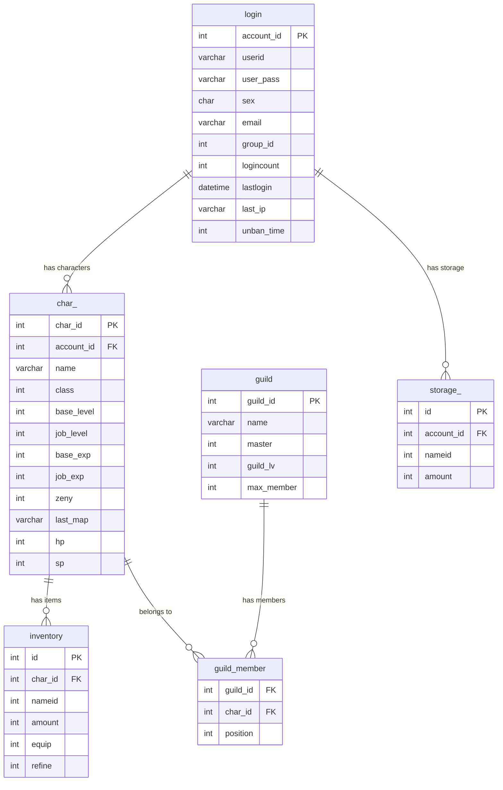

### Banco rAthena — Tabelas Principais

| Banco | Tabelas Chave | Propósito |
|-------|---------------|-----------|
| `ragnarok` | login, char_, inventory, cart_inventory, storage_, guild, guild_member, party, pet, homunculus, mercenary, skill, memo, quest | Dados do jogo |
| `ragnarok_log` | atcommandlog, branchlog, chatlog, loginlog, mvplog, npclog, picklog, zenylog | Auditoria e logs de jogo |

### Banco Zabbix (Separado)

| Banco | Propósito |
|-------|-----------|
| `zabbix` | Métricas, alertas, hosts, templates, histórico — gerenciado pelo Zabbix Server |

O Zabbix utiliza o **mesmo container MariaDB** do rAthena, mas com um **banco de dados isolado** (`zabbix`). Esta abordagem evita overhead de um segundo container MariaDB enquanto mantém isolamento lógico. O usuário `zabbix` tem ALL PRIVILEGES apenas no banco `zabbix`, sem acesso ao banco `ragnarok`.

### Usuários de Banco

| Usuário | Banco | Privilégios | Propósito |
|---------|-------|-------------|-----------|
| `rathena` | ragnarok, ragnarok_log | SELECT, INSERT, UPDATE, DELETE | Operação dos servidores rAthena |
| `rathena_backup` | ragnarok, ragnarok_log | SELECT, LOCK TABLES, SHOW VIEW, EVENT, TRIGGER | Backup (mariadb-dump) |
| `fluxcp` | ragnarok | SELECT, INSERT, UPDATE, DELETE | Painel web FluxCP |
| `zabbix` | zabbix | ALL PRIVILEGES | Zabbix Server (banco isolado) |
| `root` | * | ALL (local only) | Administração emergencial |

**Nota:** O usuário `rathena_backup` requer SHOW VIEW, EVENT e TRIGGER além de SELECT e LOCK TABLES para suportar as opções `--routines --triggers --events` do mariadb-dump conforme Requisito 7.

### Configuração MariaDB (custom.cnf)

```ini
[mysqld]
# Performance
innodb_buffer_pool_size = 1024M  # 50% de 2GB alocados, mín 128MB
innodb_log_file_size = 256M
innodb_flush_log_at_trx_commit = 2
max_connections = 151

# Charset
character-set-server = utf8mb4
collation-server = utf8mb4_general_ci

# Logging
log-bin = mysql-bin
expire_logs_days = 7
slow_query_log = 1
long_query_time = 2
slow_query_log_file = /var/lib/mysql/slow-query.log

# Security
skip-name-resolve
bind-address = 0.0.0.0
```

**Nota:** O valor `innodb_buffer_pool_size` no `custom.cnf` é o valor padrão para 2GB de RAM alocada. Para cálculo dinâmico, o entrypoint do container pode usar script wrapper:

```bash
# docker/mariadb-entrypoint-wrapper.sh
#!/bin/bash
MEMORY_LIMIT=$(cat /sys/fs/cgroup/memory.max 2>/dev/null || cat /sys/fs/cgroup/memory/memory.limit_in_bytes)
BUFFER_POOL=$((MEMORY_LIMIT / 2))
MIN_BUFFER=134217728  # 128MB

if [ "$BUFFER_POOL" -lt "$MIN_BUFFER" ]; then
    BUFFER_POOL=$MIN_BUFFER
fi

# Converte para MB para o cnf
BUFFER_MB=$((BUFFER_POOL / 1048576))
sed -i "s/innodb_buffer_pool_size = .*/innodb_buffer_pool_size = ${BUFFER_MB}M/" /etc/mysql/conf.d/custom.cnf

exec docker-entrypoint.sh "$@"
```

## Dockerfile Multi-Stage Build Strategy

### Diagrama de Stages

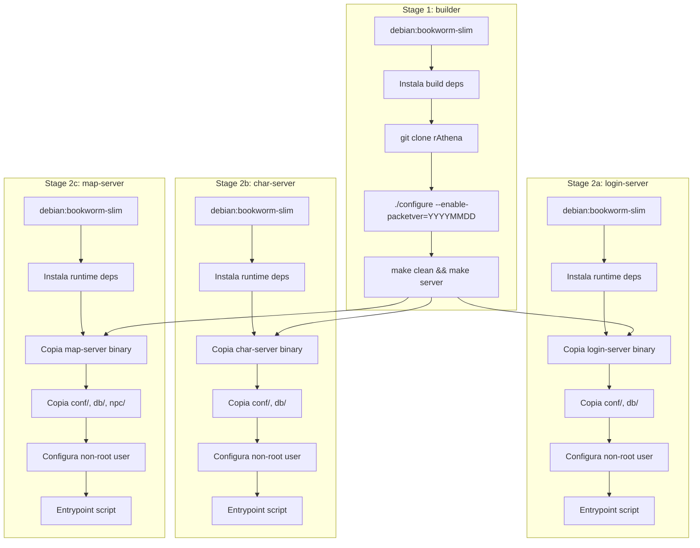

### Dockerfile — Estrutura

```dockerfile
# ============================================================
# Stage 1: Builder
# ============================================================
FROM debian:bookworm-slim AS builder

ARG PACKETVER=20211103
ARG RATHENA_BRANCH=master

RUN apt-get update && apt-get install -y --no-install-recommends \
    git gcc g++ make libmariadb-dev libmariadb-dev-compat \
    zlib1g-dev libpcre3-dev && \
    rm -rf /var/lib/apt/lists/*

WORKDIR /src
RUN git clone --depth 1 --branch ${RATHENA_BRANCH} \
    https://github.com/rathena/rathena.git .

RUN ./configure --enable-packetver=${PACKETVER} && \
    make clean && make server

# ============================================================
# Stage 2: Login Server
# ============================================================
FROM debian:bookworm-slim AS login-server

RUN apt-get update && apt-get install -y --no-install-recommends \
    libmariadb3 zlib1g libpcre3 netcat-openbsd && \
    rm -rf /var/lib/apt/lists/*

RUN groupadd -g 1000 rathena && useradd -u 1000 -g rathena -m rathena

WORKDIR /rathena
COPY --from=builder /src/login-server ./
COPY --from=builder /src/conf ./conf
COPY --from=builder /src/db ./db
COPY docker/entrypoint-login.sh /entrypoint.sh
RUN chmod +x /entrypoint.sh && chown -R rathena:rathena /rathena

USER rathena
EXPOSE 6900
HEALTHCHECK --interval=30s --timeout=10s --start-period=120s --retries=3 \
    CMD nc -z localhost 6900 || exit 1
ENTRYPOINT ["/entrypoint.sh"]

# ============================================================
# Stage 3: Char Server (similar structure)
# ============================================================
FROM debian:bookworm-slim AS char-server
# ... (mesma estrutura, copia char-server binary, expõe 6121)

# ============================================================
# Stage 4: Map Server (similar structure)
# ============================================================
FROM debian:bookworm-slim AS map-server
# ... (mesma estrutura, copia map-server binary + npc/, expõe 5121)
```

### Entrypoint Script (template)

O entrypoint substitui placeholders nos arquivos de configuração por variáveis de ambiente em tempo de execução:

```bash
#!/bin/bash
set -e

# Templates em volume read-only, output em tmpfs
envsubst < /rathena/conf/templates/inter_athena.conf.tmpl > /rathena/conf/generated/inter_athena.conf
envsubst < /rathena/conf/templates/login_athena.conf.tmpl > /rathena/conf/generated/login_athena.conf

exec ./login-server --conf /rathena/conf/generated/
```

## Security Architecture

### Diagrama de Camadas de Segurança

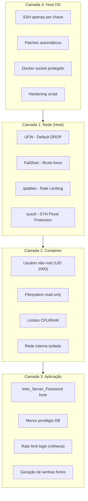

### Proteção contra DDoS — Regras iptables

```bash
# Rate limiting: 10 novas conexões/s por IP POR PORTA nas portas rAthena
iptables -A INPUT -p tcp --dport 6900 -m state --state NEW \
    -m hashlimit --hashlimit-above 10/sec --hashlimit-burst 15 \
    --hashlimit-mode srcip --hashlimit-name rathena_login -j DROP
iptables -A INPUT -p tcp --dport 6121 -m state --state NEW \
    -m hashlimit --hashlimit-above 10/sec --hashlimit-burst 15 \
    --hashlimit-mode srcip --hashlimit-name rathena_char -j DROP
iptables -A INPUT -p tcp --dport 5121 -m state --state NEW \
    -m hashlimit --hashlimit-above 10/sec --hashlimit-burst 15 \
    --hashlimit-mode srcip --hashlimit-name rathena_map -j DROP

# Limite de conexões simultâneas: 20 por IP POR PORTA
iptables -A INPUT -p tcp --dport 6900 -m connlimit \
    --connlimit-above 20 --connlimit-mask 32 -j DROP
iptables -A INPUT -p tcp --dport 6121 -m connlimit \
    --connlimit-above 20 --connlimit-mask 32 -j DROP
iptables -A INPUT -p tcp --dport 5121 -m connlimit \
    --connlimit-above 20 --connlimit-mask 32 -j DROP

# SYN cookies
sysctl -w net.ipv4.tcp_syncookies=1
sysctl -w net.ipv4.tcp_max_syn_backlog=2048
```

### Configuração de Containers (Segurança)

```yaml
# Exemplo: Login Server
login-server:
  read_only: true
  tmpfs:
    - /tmp
    - /run
    - /rathena/conf/generated  # Configs gerados pelo entrypoint
  volumes:
    - ./conf/templates:/rathena/conf/templates:ro  # Templates read-only
  security_opt:
    - no-new-privileges:true
  cap_drop:
    - ALL
```

### Geração e Validação de Senhas

Implementada no script `setup.sh` durante o primeiro provisionamento:

```bash
generate_password() {
    openssl rand -base64 48 | tr -dc 'a-zA-Z0-9!@#$%^&*' | head -c 32
}

validate_password() {
    local pass="$1"
    if [ ${#pass} -lt 16 ]; then
        echo "[WARN] Senha fraca detectada (< 16 caracteres). Recomenda-se trocar." | tee -a /var/log/rathena-setup.log
        return 0  # Permite inicialização com aviso
    fi
    if ! echo "$pass" | grep -qP '[!@#$%^&*]'; then
        echo "[WARN] Senha sem caracteres especiais. Recomenda-se trocar." | tee -a /var/log/rathena-setup.log
    fi
}

# No primeiro deploy, se .env não tem credenciais definidas:
# MARIADB_ROOT_PASSWORD, RATHENA_DB_PASSWORD, INTER_SERVER_PASSWORD, etc.
# são gerados automaticamente via generate_password()
```

### Processo de Atualização de Segurança do rAthena

1. **Monitoramento de CVEs**: Verificar periodicamente o [rAthena Security Advisories](https://github.com/rathena/rathena/security/advisories)
2. **Procedimento de patch**:
   - Atualizar `RATHENA_BRANCH` ou commit no Dockerfile build arg
   - Executar pipeline CI para rebuild das imagens
   - Deploy via workflow_dispatch com backup automático pré-deploy
   - Verificar healthchecks pós-deploy
3. **Rollback**: Se o patch introduz regressão, usar workflow de rollback
4. **Documentação**: Registrar CVE mitigada no CHANGELOG

## Monitoring and Alerting Architecture

### Diagrama de Fluxo de Monitoramento

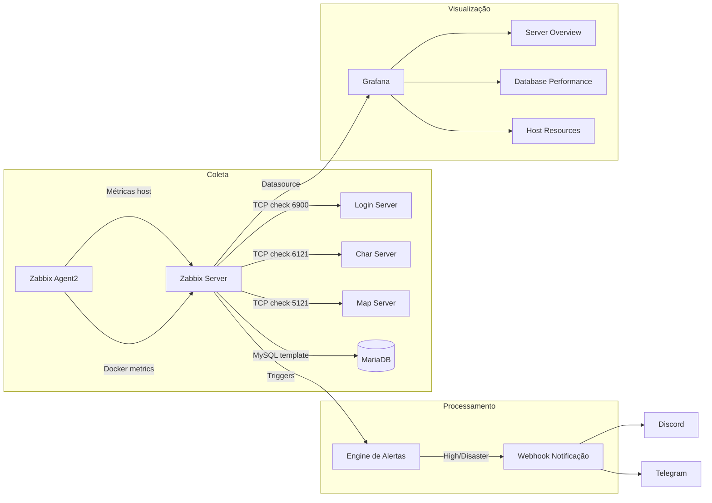

### Triggers de Alerta

| Trigger | Condição | Severidade | Ação |
|---------|----------|-----------|------|
| CPU alta | >80% por 5min (>0%) | High | Webhook |
| Memória alta | >85% por 3min | High | Webhook |
| Disco crítico | <10% livre | Disaster | Webhook |
| Serviço rAthena down | TCP fail 30s | Disaster | Webhook |
| MariaDB slow queries | >10 slow/min | Warning | Log |
| Backup falhou | Exit code != 0 | High | Webhook |

### Configuração de Retenção Zabbix

Configurada via variáveis de ambiente do container Zabbix Server:

| Variável | Valor | Propósito |
|----------|-------|-----------|
| `ZBX_HISTORYSTORAGEDATEINDEX` | 1 | Otimiza queries de histórico |

A retenção é configurada por item/template no Zabbix:
- **History**: 90 dias (configurado nos templates de monitoramento)
- **Trends**: 365 dias (configurado nos templates de monitoramento)

Valores definidos via Zabbix API durante o provisioning inicial ou importados via template XML/YAML.

### Dashboards Grafana (Provisioning Automático)

**Estrutura de provisioning:**
```
monitoring/grafana/
├── provisioning/
│   ├── datasources/
│   │   └── zabbix.yml          # Datasource Zabbix API
│   └── dashboards/
│       └── dashboards.yml      # Provider de dashboards
└── dashboards/
    ├── server-overview.json    # Status Login/Char/Map/DB
    ├── database-performance.json # QPS, conexões, buffer, slow queries
    └── host-resources.json     # CPU, RAM, disco, rede (1min granularity)
```

**Nota de implementação:** O Grafana nativamente não condiciona provisioning de dashboards à saúde dos datasources. Para atender ao requisito de não provisionar dashboards quando o datasource falha, o container Grafana depende de `zabbix-server: condition: service_healthy`. Isso garante que o Zabbix Server está operacional antes do Grafana iniciar o provisioning. Falhas de conexão pós-startup são tratadas pelo Grafana com retry automático e alertas no log.

## Backup and Recovery Architecture

### Diagrama de Backup

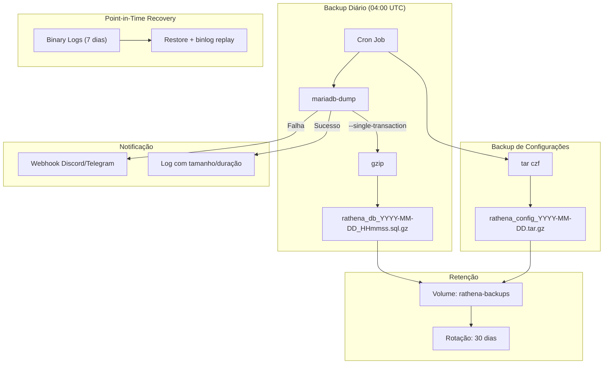

### Objetivos de Recuperação

| Cenário | RPO | RTO | Método |
|---------|-----|-----|--------|
| Backup completo | 24 horas | 30 minutos | Restore do dump SQL |
| Com Binary Logs | Minutos | 45 minutos | Dump + binlog replay |
| Configurações | 24 horas | 5 minutos | Restore do tar.gz |

### Script de Restauração (restore.sh)

```bash
#!/bin/bash
# Uso: ./restore.sh <arquivo_backup.sql.gz>
# 1. Para serviços rAthena
# 2. Valida arquivo de backup
# 3. Restaura banco de dados
# 4. Verifica integridade
# 5. Reinicia serviços
# RTO: <15min para bancos até 5GB
```

## CI/CD Pipeline Design

### Diagrama do Pipeline

```mermaid
graph TD
    subgraph PR["Pull Request"]
        Lint[Hadolint + shellcheck] --> ComposeValidate["docker compose config"]
        ComposeValidate --> EnvCheck["Validar .env.example"]
        EnvCheck --> BuildTest["Build de teste (sem push)"]
    end

    subgraph Merge["Merge → main"]
        Build[Build imagens] --> Tag["Tag: ghcr.io/org/rathena-*:sha-abc123"]
        Tag --> Push["Push para GHCR"]
    end

    subgraph Deploy["workflow_dispatch"]
        BackupPre["Backup pré-deploy"] --> SSHConnect["SSH ao servidor"]
        SSHConnect --> Pull["docker compose pull"]
        Pull --> Recreate["docker compose up -d"]
        Recreate --> HealthWait["Aguarda healthchecks"]
        HealthWait -->|OK| Success[Deploy OK]
        HealthWait -->|Falha| Rollback["Rollback automático"]
    end

    subgraph RollbackWF["Workflow: Rollback"]
        GetPrev["Obter tag anterior"] --> PullPrev["Pull imagens anteriores"]
        PullPrev --> RecreatePrev["Recreate containers"]
    end
```

### Workflows GitHub Actions

| Workflow | Trigger | Ações |
|----------|---------|-------|
| `validate.yml` | PR create/update | hadolint, shellcheck, compose config, env check, build test, **trivy image scan** |
| `build.yml` | Merge → main | Build multi-stage, tag SHA, push GHCR |
| `deploy.yml` | workflow_dispatch | Backup DB, SSH, pull, recreate, health verify |
| `rollback.yml` | workflow_dispatch | Revert para tag anterior |

O workflow `validate.yml` inclui scan de vulnerabilidades via Trivy nas imagens construídas durante o build de teste, bloqueando merge se vulnerabilidades CRITICAL ou HIGH são encontradas.

### Secrets Necessários

| Secret | Propósito |
|--------|-----------|
| `SSH_PRIVATE_KEY` | Acesso ao servidor de produção |
| `SERVER_HOST` | IP/hostname do servidor |
| `SERVER_USER` | Usuário SSH (não-root) |
| `GHCR_TOKEN` | Push de imagens para registry |

## Deployment Flow

### Provisionamento Inicial (Novo Servidor)

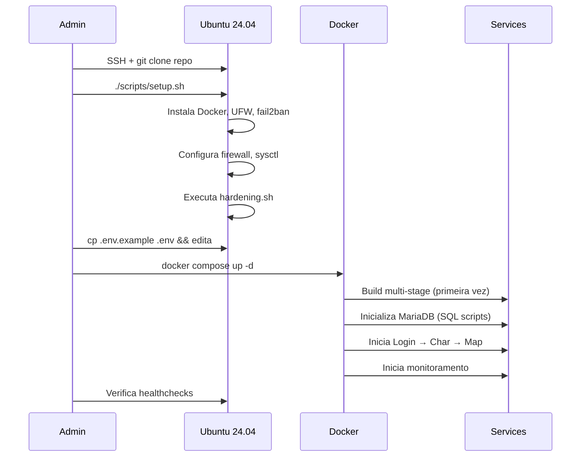

### Estrutura de Diretórios do Projeto

```
ragnarok-server/
├── docker-compose.yml
├── .env.example
├── Dockerfile                    # Multi-stage (login, char, map targets)
├── docker/
│   ├── entrypoint-login.sh
│   ├── entrypoint-char.sh
│   ├── entrypoint-map.sh
│   └── fluxcp/
│       └── Dockerfile            # PHP 8.2 + Apache + FluxCP
├── conf/                         # Configs rAthena (montados como volume)
│   └── templates/                # Templates rAthena (read-only mount)
│       ├── inter_athena.conf.tmpl
│       ├── login_athena.conf.tmpl
│       ├── char_athena.conf.tmpl
│       └── map_athena.conf.tmpl
├── sql/                          # Scripts inicialização DB
│   ├── main.sql
│   ├── logs.sql
│   └── 00-setup-users.sql
├── npc/custom/                   # NPCs customizados
├── db/conf.d/
│   └── custom.cnf                # Tuning MariaDB
├── monitoring/
│   ├── grafana/
│   │   ├── provisioning/
│   │   │   ├── datasources/zabbix.yml
│   │   │   └── dashboards/dashboards.yml
│   │   └── dashboards/
│   │       ├── server-overview.json
│   │       ├── database-performance.json
│   │       └── host-resources.json
│   └── zabbix/
│       └── templates/            # Templates customizados
├── scripts/
│   ├── setup.sh                  # Provisionamento host
│   ├── hardening.sh              # Hardening do host
│   ├── backup/
│   │   ├── backup.sh             # Script de backup
│   │   └── crontab               # Agendamento
│   └── restore.sh                # Restauração
├── .github/
│   └── workflows/
│       ├── validate.yml
│       ├── build.yml
│       ├── deploy.yml
│       └── rollback.yml
└── docs/
    └── RUNBOOK.md
```

### Estrutura do Runbook (docs/RUNBOOK.md)

```
RUNBOOK.md
├── 1. Tabela de Decisão Rápida
│   └── Colunas: Sintoma | Severidade | Causas | Diagnóstico | Ação
├── 2. Procedimentos por Serviço
│   ├── 2.1 Login Server (4 cenários)
│   ├── 2.2 Char Server (4 cenários)
│   ├── 2.3 Map Server (4 cenários)
│   └── 2.4 MariaDB (5 cenários)
├── 3. Operações de Rotina
│   ├── 3.1 Restore de Backup
│   ├── 3.2 Atualização do rAthena
│   └── 3.3 Rollback de Deploy
├── 4. Comandos de Diagnóstico
│   ├── 4.1 Logs de Containers
│   ├── 4.2 Métricas de Sistema
│   ├── 4.3 Conexões MariaDB
│   └── 4.4 Estado dos Healthchecks
└── 5. Contatos e Escalação
```

## Correctness Properties

Esta feature é primariamente **Infrastructure as Code (IaC)** — Docker Compose, Dockerfiles, scripts de shell e configuração declarativa. Property-Based Testing **não se aplica** a este tipo de feature porque:

- Docker Compose é configuração declarativa, não funções com input/output testáveis
- Scripts de shell executam side-effects (instalar pacotes, configurar firewall) sem retorno de dados transformados
- Não existem propriedades universais quantificáveis ("para todo X, Y vale") neste domínio
- A validação correta é feita por: linting (hadolint, shellcheck), smoke tests, healthchecks e testes de integração

A estratégia de validação adequada está documentada na seção Testing Strategy.

## Error Handling

### Estratégia de Tratamento de Erros por Camada

| Camada | Erro | Tratamento | Recuperação |
|--------|------|-----------|-------------|
| Container | Crash do processo | Healthcheck detecta | Autoheal reinicia container |
| Container | OOM Kill | Docker mata container | Restart automático (restart policy) + alerta |
| Rede | MariaDB inacessível | Login Server falha healthcheck | Restart com backoff |
| Aplicação | Inter_Server_Password errada | Char/Map não conecta | Alerta + log |
| Banco | Corrupção InnoDB | MariaDB não inicia | Restore de backup |
| Disco | Disco cheio | Containers param | Alerta Disaster + cleanup |
| Backup | mariadb-dump falha | Exit code != 0 | Webhook + retry no próximo ciclo |
| Deploy | Imagem nova falha | Healthcheck não passa | Rollback automático |
| Host | SSH brute-force | Fail2ban detecta | Ban IP 600s |
| Rede | DDoS nas portas RO | Rate limit iptables | DROP pacotes excedentes |

### Cadeia de Recuperação Automática

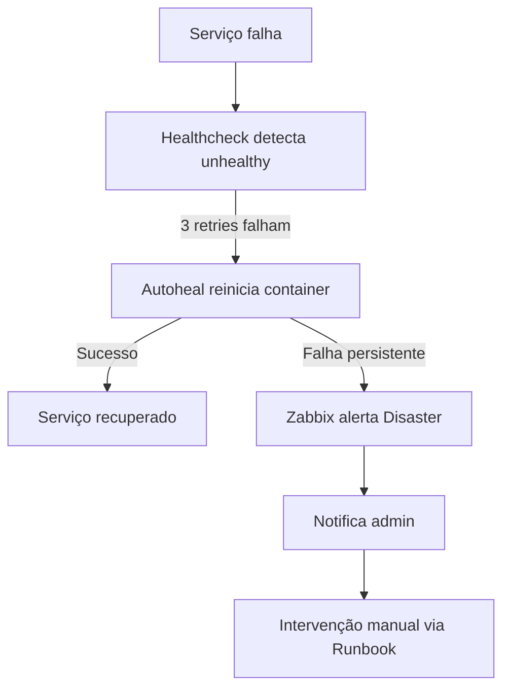

### FluxCP — Tratamento de Indisponibilidade do DB

Quando o MariaDB está indisponível, o FluxCP:
1. Exibe página de erro amigável ("Serviço temporariamente indisponível")
2. Não expõe detalhes internos (IP do banco, credenciais)
3. Container continua rodando com retry automático via healthcheck
4. Zabbix detecta e alerta

## Testing Strategy

### Abordagem de Testes

Esta infraestrutura é primariamente composta por **Infrastructure as Code (IaC)**, **configuração declarativa** (Docker Compose, YAML) e **scripts de shell**. Property-Based Testing (PBT) **não é apropriado** para este tipo de feature pelos seguintes motivos:

1. **Docker Compose é declarativo** — não há funções com input/output para testar com propriedades universais
2. **Scripts de shell** são procedurais com side-effects (instalar pacotes, configurar firewall)
3. **A infraestrutura testa-se pela execução** — healthchecks, smoke tests, integration tests
4. **Não há transformação de dados** — os componentes são orquestração e configuração

### Estratégia de Validação

| Tipo de Teste | Ferramenta | O que Valida |
|---------------|-----------|--------------|
| Lint de Dockerfiles | Hadolint | Best practices, segurança |
| Lint de shell scripts | Shellcheck | Erros de sintaxe, portabilidade |
| Validação Compose | `docker compose config` | Sintaxe YAML, referências |
| Validação .env | Script customizado | Variáveis necessárias presentes |
| Build test | `docker build --target` | Compilação do rAthena bem-sucedida |
| Smoke test | docker compose up + healthchecks | Serviços iniciam e respondem |
| Integration test | Script pós-deploy | Cadeia Login→Char→Map funcional |
| Security scan | Trivy | Vulnerabilidades nas imagens |
| Backup test | Restore em ambiente test | Backup é restaurável |

### Testes de Validação CI (Automatizados)

1. **hadolint** — Verifica Dockerfiles contra best practices
2. **shellcheck** — Valida scripts bash (setup.sh, hardening.sh, backup.sh, restore.sh)
3. **docker compose config --quiet** — Valida sintaxe do docker-compose.yml
4. **env-check** — Script que compara .env.example com variáveis referenciadas
5. **docker build** — Build completo das imagens (sem publish) para validar compilação

### Testes de Integração (Pós-Deploy)

1. **Healthcheck chain** — Todos os serviços reportam healthy
2. **TCP connectivity** — Portas 6900, 6121, 5121 respondem
3. **MariaDB connection** — rAthena conecta e executa query
4. **Grafana datasource** — Zabbix datasource conecta
5. **Backup execution** — Backup executa e gera arquivo válido
6. **Restore test** — Restore do backup em ambiente isolado (periódico)
